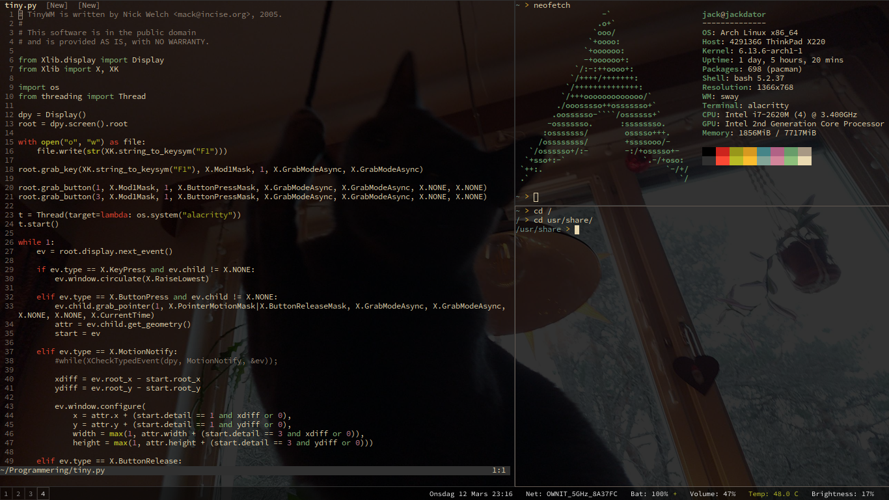

# dotfiles

My configuration files for my Linux enviroment consisting of Sway, Neovim and Alacritty.

Most colors (including the colors for Sway, Neovim and Alacritty) are loaded from the colors.env file which make them easily maintainable. Currently most of it comes from Gruvbox - while it's a very good theme, I'd like to make my own one sooner or later.

There's a lot of cleaning up to do in .bashrc and init.vim.

I'd also like to make my setup more framebuffer-friendly by tweaking Tmux and Neovim more.

## Screenshot

